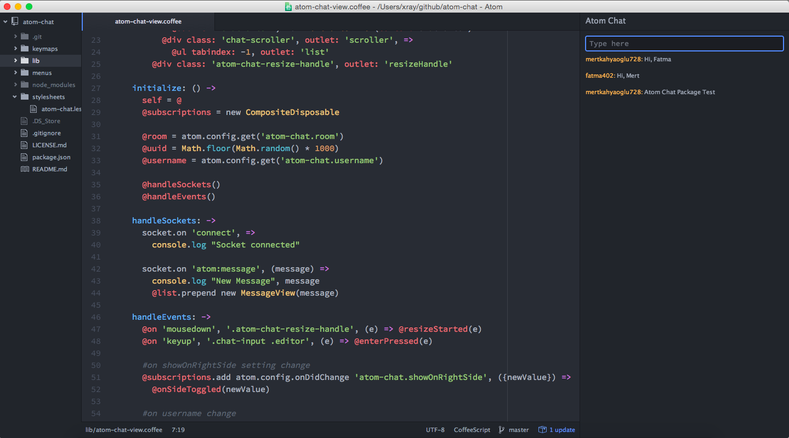

Atom Chat
==========

>Chat package for Atom Editor

[1]: http://mertkahyaoglu.github.io/brainballs/

### Configuration

The atom-chat package accepts the following configuration values:

* `atom-chat.username` &mdash; username displayed on the chat.
* `atom-chat.showOnRightSide` &mdash; panel to be displayed in

### Server

Currently Atom Chat running on Heroku server. [Go to repo](https://github.com/mertkahyaoglu/atom-chat-server)

### TODOS

* Chat rooms
* GitHub integration
* Private messaging
* Emoji
